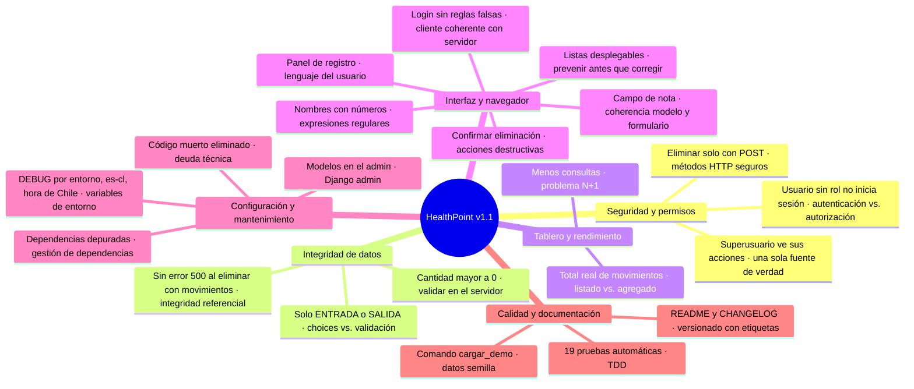

# Mapa conceptual: de v1.0-evaluado a v1.1

Cada hoja es un cambio con su propio *commit*. Después del punto (·) va el concepto técnico detrás del cambio. La versión con diseño completo está en [mapa-cambios.html](mapa-cambios.html) (descárgala y ábrela en el navegador) y el detalle en [CHANGELOG.md](../CHANGELOG.md).

## Commits por cambio

| Tema | Cambio | Commit |
|---|---|---|
| Seguridad | Eliminar solo con POST | [ebcd6f8](https://github.com/Mikhassdev/healthpoint/commit/ebcd6f8) |
| Seguridad | Usuario sin rol no inicia sesión | [e89128c](https://github.com/Mikhassdev/healthpoint/commit/e89128c) |
| Seguridad | Superusuario ve sus acciones | [489e16d](https://github.com/Mikhassdev/healthpoint/commit/489e16d) |
| Datos | Sin error 500 al eliminar con movimientos | [73e62f6](https://github.com/Mikhassdev/healthpoint/commit/73e62f6) |
| Datos | Cantidad mayor a 0 | [0cc7ea7](https://github.com/Mikhassdev/healthpoint/commit/0cc7ea7) |
| Datos | Solo ENTRADA o SALIDA | [40e2fd4](https://github.com/Mikhassdev/healthpoint/commit/40e2fd4) |
| Rendimiento | Total real de movimientos | [d9ead65](https://github.com/Mikhassdev/healthpoint/commit/d9ead65) |
| Rendimiento | Consultas N+1 | [6f14094](https://github.com/Mikhassdev/healthpoint/commit/6f14094) |
| Interfaz | Login sin reglas falsas | [7816a84](https://github.com/Mikhassdev/healthpoint/commit/7816a84) |
| Interfaz | Nombres con números | [d24ddd7](https://github.com/Mikhassdev/healthpoint/commit/d24ddd7) |
| Interfaz | Listas desplegables | [e864581](https://github.com/Mikhassdev/healthpoint/commit/e864581) |
| Interfaz | Campo de nota | [734ea55](https://github.com/Mikhassdev/healthpoint/commit/734ea55) |
| Interfaz | Confirmar eliminación | [dfc222e](https://github.com/Mikhassdev/healthpoint/commit/dfc222e) |
| Interfaz | Panel de registro | [7d9544d](https://github.com/Mikhassdev/healthpoint/commit/7d9544d) |
| Configuración | DEBUG por entorno, idioma y hora | [922eac9](https://github.com/Mikhassdev/healthpoint/commit/922eac9) |
| Configuración | Dependencias depuradas | [9399b0b](https://github.com/Mikhassdev/healthpoint/commit/9399b0b) |
| Configuración | Código muerto eliminado | [9632e7f](https://github.com/Mikhassdev/healthpoint/commit/9632e7f) |
| Configuración | Modelos en el admin | [8736ed1](https://github.com/Mikhassdev/healthpoint/commit/8736ed1) |
| Calidad | Comando cargar_demo | [98bace2](https://github.com/Mikhassdev/healthpoint/commit/98bace2) |
| Calidad | README y CHANGELOG | [d184a65](https://github.com/Mikhassdev/healthpoint/commit/d184a65) |
